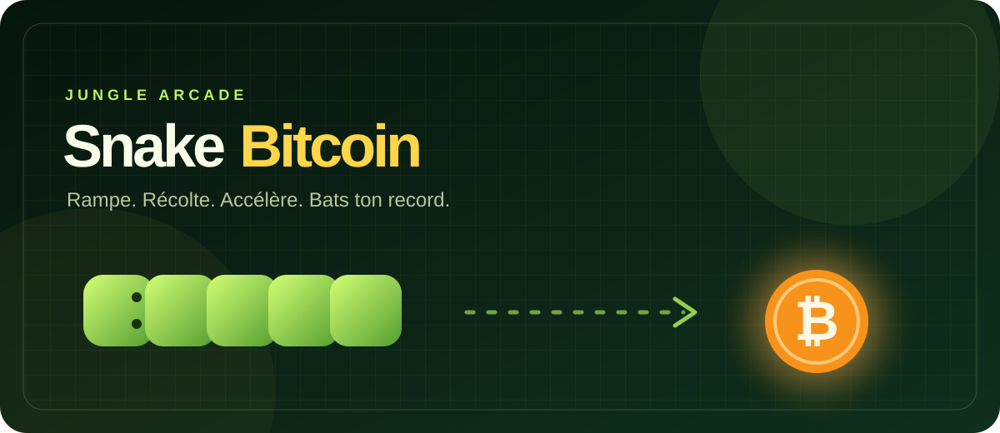
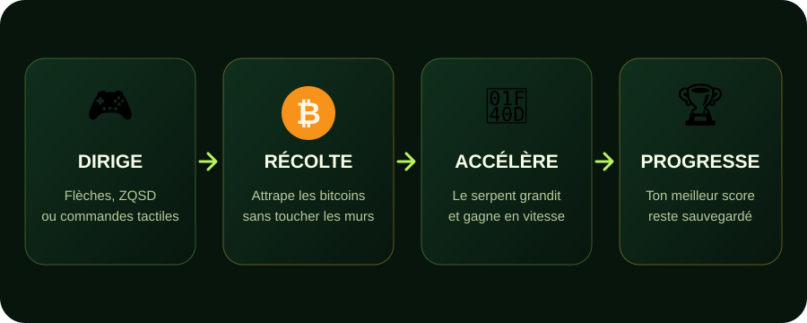

<div align="center">



# 🐍 Snake Bitcoin

**Un Snake de poche aux couleurs de la jungle, où chaque bouchée vaut un bitcoin.**

[](snake-bananes.html)


</div>

## Le projet

**Snake Bitcoin** revisite le jeu d’arcade classique dans une ambiance jungle sombre et lumineuse. Guide le serpent sur une grille de 20 × 20 cases, collecte les bitcoins, grandis à chaque prise et évite les murs ainsi que ta propre queue.

Tout tient dans un unique fichier HTML : aucun framework, aucune installation et aucune connexion ne sont nécessaires pour jouer.



## Points forts

- 🎯 Gameplay immédiat et difficulté progressive : la vitesse augmente avec le score.
- 🏆 Record sauvegardé dans le navigateur grâce à `localStorage`.
- ⌨️ Commandes compatibles avec les flèches, `ZQSD` et `WASD`.
- 📱 Interface responsive avec pavé directionnel tactile sur mobile.
- ⏸️ Pause et reprise instantanées avec la barre d’espace.
- 🌿 Design original : grille jungle, serpent lumineux et bitcoins animés visuellement.
- 📦 Zéro dépendance : HTML, CSS et JavaScript natifs uniquement.

## Jouer

1. Télécharge ou clone le dépôt.
2. Ouvre [`snake-bananes.html`](snake-bananes.html) dans un navigateur moderne.
3. Clique sur **Commencer** ou appuie sur `Entrée`.

```bash
git clone https://github.com/Lara21000/BTC_Snake.git
cd BTC_Snake
```

Tu peux aussi servir le dossier avec le petit serveur local de ton choix, mais ce n’est pas obligatoire.

## Commandes

| Action | Clavier | Mobile / tactile |
|---|---|---|
| Se déplacer | Flèches, `ZQSD` ou `WASD` | Boutons directionnels |
| Mettre en pause | `Espace` | Bouton **Continuer** pour reprendre |
| Démarrer / rejouer | `Entrée` ou bouton à l’écran | Bouton à l’écran |

## Règles

Chaque bitcoin collecté ajoute un point et allonge le serpent. La partie se termine si sa tête touche une bordure ou une partie de son propre corps. Plus le score monte, plus le délai entre deux déplacements diminue, jusqu’à une vitesse maximale pensée pour garder le jeu maîtrisable.

## Architecture

```text
BTC_Snake/
├── assets/
│   ├── gameplay.svg
│   └── readme-hero.svg
├── AGENTS.md
├── README.md
└── snake-bananes.html
```

Le fichier principal regroupe :

- la structure accessible de l’interface en HTML ;
- le thème responsive en CSS ;
- la boucle de jeu, les collisions, le score et le rendu Canvas en JavaScript.

## Personnalisation rapide

Les couleurs principales sont centralisées dans les variables CSS au début de `snake-bananes.html`. La taille de la grille est définie par `cells`, tandis que la courbe de difficulté se règle dans la fonction `speed()`.

---

<div align="center">
  <sub>Conçu pour quelques minutes de détente… et beaucoup de revanche.</sub><br>
  <strong>🌴 🐍 ₿</strong>
</div>
